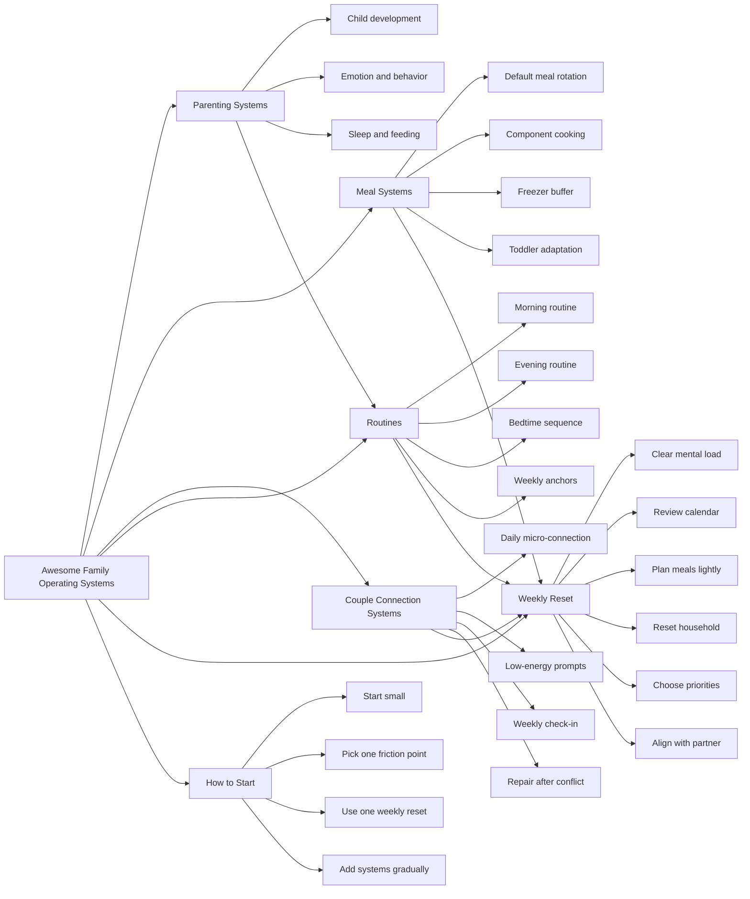

# Awesome Family Operating Systems

A curated list of practical systems, tools, and resources for running a family with intention, clarity, and less overwhelm.

This is not a collection of opinions or trends.  
It is a structured set of approaches that help families navigate real constraints:
- limited time
- working parents
- young children
- competing priorities

The goal is simple:  
create a family life that feels calm, functional, and connected.

---

## What is a “Family Operating System”?

A Family Operating System (FOS) is the set of systems that governs how a household runs:
- routines (morning, bedtime, meals)
- decision rules (what to prioritize, when to simplify)
- communication patterns
- division of responsibilities
- emotional climate

Most families operate without an explicit system.  
This repository is about making those systems visible and intentional.

---

## Contents

- Parenting Systems → see `awesome-parenting.md`
- (coming soon) Meal Systems
- (coming soon) Couple Connection Systems
- (coming soon) Household Management Systems

---

## Philosophy

- Systems over hacks  
- Clarity over perfection  
- Sustainability over intensity  
- Real life over ideal life  

---

## Contributing

Contributions are welcome, but should follow the spirit of this repository:
- practical
- tested or well-supported
- clearly described
- not trend-driven

See `CONTRIBUTING.md` for details.

---

## Family Operating System Map

Life can be messy. But you can make systems to navigate family life calmly.

